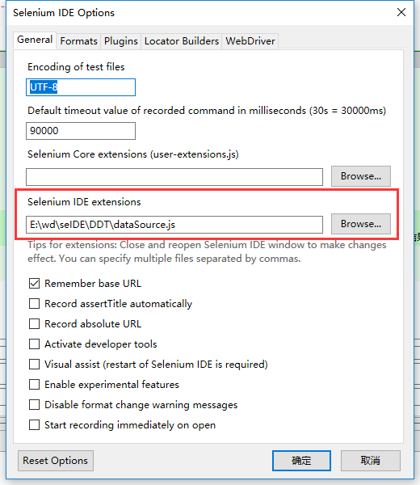
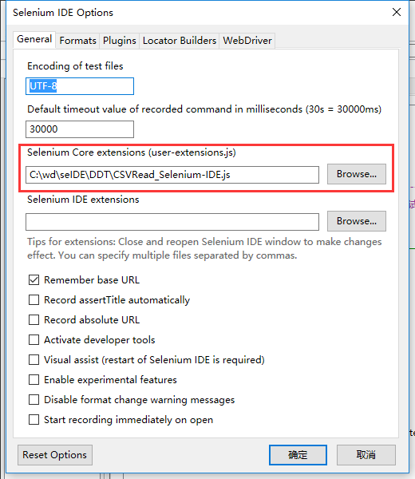
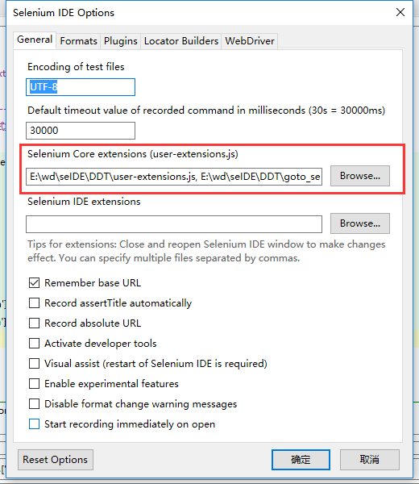

# DDT

DDT Data Drive Test，数据驱动测试，也称为参数化。

## DDT 方案一：js 数据文件

通过下面的流程控制扩展，实现对 JS 数据文件的循环读取操作。

- [Selenium IDE: Flow Control](https://addons.mozilla.org/en-US/firefox/addon/flow-control/)

### 数据格式

js 文件中按下面的方式存放测试数据

```javascript
varname = "value"
```

### 安装配置

需要把 js 数据文件，在 Options 对话框中进行设置，如下图所示：



### 被测网站：百度

百度：http://www.baidu.com

_测试案例及数据文件_

- [baiduSearch.html](JS/baiduSearch.html)  
  循环读取 JS 数据文件中的数据，打开百度首页，搜索相应的关键字
- [baiduSearchData.js](JS/baiduSearchData.js)  
  本 js 格式的数据文件包含了需要在百度上检索的关键字列表
  
### 被测网站：51CTO学院

51CTO学院：http://edu.51cto.com

_测试案例及数据文件_

- [51ctoLens.html](JS/51ctoLens.html)  
  循环读取 JS 数据文件中的数据，打开所有学生的51CTO学院页面，统计总共学习时长和平均学习时长并打印
- [51ctoLensData.js](JS/51ctoLensData.js)  
  本 js 格式的数据文件包含了所有学生51CTO学院页面列表
  
### 被测网站：手机号码归属地查询

手机号码归属地查询：http://www.atool.org

_测试案例及数据文件_

- [mobile.html](JS/mobile.html)  
  循环读取 JS 数据文件中的数据，打开手机号码归属地查询网页，对各类手机号码进行查询并验证
- [mobileData.js](JS/mobileData.js)  
  本 js 格式的数据文件包含了各类手机号码及其归属地和运营商列表
  
### 被测网站：hostedredmine

hostedredmine: http://www.hostedredmine.com

_测试案例及数据文件_

- [redmineLogin.html](JS/redmineLogin.html)  
  循环读取 JS 数据文件中的数据，对 hostedredmine 网站登录功能的自动化测试
- [redmineLoginData.js](JS/redmineLoginData.js)  
  本 js 格式的数据文件包含了登录 hostedredmine 网站可能出现的三种情况列表
  
## DDT 方案二：CSV 数据文件 

通过下面的 js 扩展，实现对 CSV 数据文件读取操作。

- [CSVRead_Selenium-IDE.js](CSVRead_Selenium-IDE.js) 
- [Selenium IDE: Flow Control](https://addons.mozilla.org/en-US/firefox/addon/flow-control/)

### 安装配置

如下图所示：



### 被测网站：hostedredmine

hostedredmine：http://www.hostedredmine.com/

_测试案例及数据文件_

- [loginHRedmine.html](CSV/loginHRedmine.html)  
  不同账户的用户名和密码，进行登录身份验证。
- [loginHRedmineData.csv](CSV/loginHRedmineData.csv)  
  用户名和密码列表的数据文件。  
  
### 被测网站：51CTO 学院

51CTO 学院：http://edu.51cto.com

_测试案例及数据文件_

- [51ctoLens.html](CSV/51ctoLens.html)  
  打开所有学生的 51CTO 网站学习页面
- [51ctoLensData.csv](CSV/51ctoLensData.csv)  
  所有学生 51CTO 网站学生学习页面网页列表的数据文件  
  
### 被测网站：手机号码归属地查询

手机号码归属地查询：http://www.atool.org

_测试案例及数据文件_

- [mobile.html](CSV/mobile.html)  
  打开手机号码归属地查询网页，对各类手机号码进行查询并验证
- [mobileData.csv](CSV/mobileData.csv)  
  各类手机号码及其归属地和运营商列表
  
### 被测网站：百度

百度：http://www.baidu.com

_测试案例及数据文件_

- [baiduSearch.html](CSV/baiduSearch.html)  
  打开百度首页，搜索相应的关键字
- [baiduSearchData.csv](CSV/baiduSearchData.csv)  
  需要在百度上检索的关键字列表
  
## DDT 方案三：XML 数据文件

通过下面三个 js 扩展，实现对 XML 数据文件载入和读取操作。

- [user-extensions.js](user-extensions.js)
- [goto_sel_ide.js](goto_sel_ide.js)
- [datadriven.js](datadriven.js) 

### 安装配置

如下图所示：



### 文件格式

XML 数据文件格式如下所示：

```xml
<testdata>
  <test varname="value" />
  <test varname="value" />
  <test varname="value" />
</testdata>
```

### 被测网站：百度

百度：http://www.baidu.com

_测试案例及数据文件_

- [baiduSearch.html](XML/baiduSearch.html)  
  打开百度首页，搜索若干关键字
- [baiduSearchData.xml](XML/baiduSearchData.xml)  
  本 XML 格式的数据文件包含了需要在百度上检索的关键字列表

### 被测网站：51CTO 学院

51CTO 学院：http://edu.51cto.com

_测试案例及数据文件_

- [studyLens.html](XML/studyLens.html)  
  统计学生学习总时长和平均时长
- [studyLensData.xml](XML/studyLensData.xml)   
  本 XML 格式的数据文件包含了学生学习记录的 URL 地址列表 

### 被测网站：hostedredmine

hostedredmine：http://www.hostedredmine.com/

_测试案例及数据文件_

- [loginHRedmine.html](XML/loginHRedmine.html)  
  用不同账户的用户名和密码，进行登录身份验证。  
- [loginHRedmineData.xml](XML/loginHRedmineData.xml)  
  用户名和密码的列表。

### 被测网站：手机号码归属地查询

手机号码归属地查询：http://www.atool.org/

_测试案例及数据文件_

- [mobile.html](XML/mobile.html)  
  打开手机号码归属地查询网页，对各类手机号码进行查询并验证
- [mobileData.xml](XML/mobileData.xml)  
  各类手机号码及其归属地和运营商列表
 
## DDT 方案四：HTML 数据文件

### 被测网站：百度

百度：http://www.baidu.com

_测试案例_

- [baiduSearch.html](HTML/baiduSearch.html)  
   打开百度首页，搜索相应的关键字
   
### 被测网站：51CTO 学院

51CTO学院：http://edu.51cto.com

_测试案例_

- [51ctoLens.html](HTML/51ctoLens.html)  
  打开所有学生的51CTO学院页面，统计总共学习时长和平均学习时长并打印
 
### 被测网站：手机号码归属地查询

手机号码归属地查询：http://www.atool.org

_测试案例_

- [mobile.html](HTML/mobile.html)  
  打开手机号码归属地查询网页，对各类手机号码进行查询并验证  
  
### 被测网站：hostedredmine

hostedredmine: http://www.hostedredmine.com

_测试案例_

- [redmineLogin.html](HTML/redmineLogin.html)  
  对 hostedredmine 网站登录功能的自动化测试
  
## DDT 方案五：JSON 数据文件

【暂时没找到资料】
